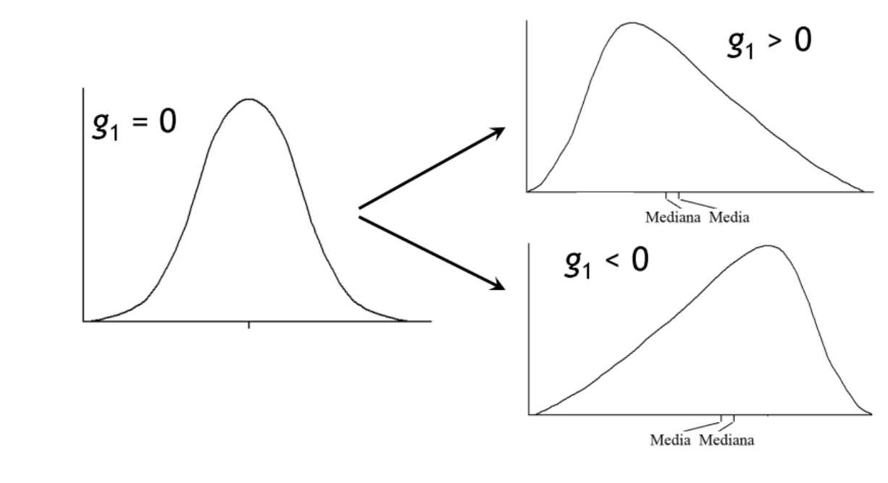

```{r setup, include=FALSE}
knitr::opts_chunk$set(echo = TRUE)
```

```{r echo=FALSE}
library(downloadthis)

## Link del script
download_link(
  link = "https://drive.google.com/file/d/1c6Wq61WZ-R22rdqObwi_A-zehPJCPE5r/view",
  button_label = "Descargar script",
  button_type = "primary",
  has_icon = TRUE,
  icon = "fa fa-save",
  self_contained = FALSE
)

```

```{r echo=FALSE}
## Link del script pdf
download_link(
  link = "https://github.com/gpandradep/Intro_est_inecol_website/raw/main/scripts/Explor.pdf",
  button_label = "Descargar script en pdf",
  button_type = "danger",
  has_icon = TRUE,
  icon = "fa fa-save",
  self_contained = FALSE
)
```

*NOTA: Para descargar los datos, dar click en el boton. Aparece una pantalla con los datos, luego dar click derecho y poner guardar como (save as). Guardar el csv donde van a trabajar*

```{r echo=FALSE}
## Link del script pdf
download_link(
  link = "https://raw.githubusercontent.com/gpandradep/Intro_est_inecol_website/main/data/airpoll.csv",
  button_label = "Descargar datos",
  button_type = "danger",
  has_icon = TRUE,
  icon = "fa fa-save",
  self_contained = FALSE
)
```

# R.1

**ESTE EJEMPLO ES DE DATOS DE EVERITT 04 P. 17. CONSISTE EN INFORMACIÓN SOBRE CONTAMINACIÓN AMBIENTAL EN EU EN ZONAS METROPOLITANAS.**

Llamo los datos (ojo que Everitt los tiene en formato dat, si están como txt, hay que llamarlos con read.table)

```{r include=FALSE}
airpoll<-source("data/chap2airpoll.dat")$value
#ap <- data.frame(airpoll)
# write.csv(ap, "apdf.csv")
#adf <- read.csv("data/airpoll.csv", header = T, sep = ";") #tabla con dato faltante
```

```{r eval=FALSE}
airpoll<-source("chap2airpoll.dat")$value
ap <- data.frame(airpoll)
# write.csv(ap, "apdf.csv")
adf <- read.csv("airpoll.csv", header = T, sep = ";") #tabla con dato faltante
```

```{r}
attach(airpoll)
airpoll
names(airpoll)
```

# Exploración Univariada

Comenzamos por ver el vector de medias y varianzas

#mean(airpoll) #sd(airpoll)\^2

```{r}
summary(airpoll)

```

```{r}
summary(airpoll$SO2)
```

vease la diferencia entre la media y la mediana para reconocer desviaciones, calculese el intervalo intercuartiles (3er-1er).

## Boxplot

```{r eval=FALSE}
#windows()
boxplot(SO2, range=0, ylab="SO2", main= "Range 0") # en este caso, los "bigotes" del boxplot ubican el máximo (1) y el mínimo (278).
```

```{r eval=FALSE}
boxplot(SO2, ylab="SO2", main= "Range 1.5") #en este caso, la función se ejecuta con range = 1.5 por defecto.
```

```{r echo=FALSE, message=FALSE, warning=FALSE, out.width="150%"}
par(mfrow= c(1,2))

boxplot(airpoll$SO2, range=0, ylab="SO2", main= "Range = 0") # en este caso, los "bigotes" del boxplot ubican el máximo (1) y el mínimo (278).

boxplot(airpoll$SO2, ylab="SO2", main= "Range = 1.5") #en este caso, la función se ejecuta con range = 1.5 por defecto.
```

```{r}
iqSO2<-69-11
iqSO2
```

Una buena regla de dedo para identificar datos atípicos es: que los puntos que caen mas allá del 3er+1.5(intercuartil) o mas bajo que 1er-1.5(intercuartil) son valores atípicos.

```{r}
atipicossup<-69+(iqSO2*1.5)
  atipicossup
```

```{r}
atipicosinf<-abs(11-(iqSO2*1.5))
  atipicosinf
```

```{r}
hist(SO2,lwd=2)
abline(v = 156, col = "blue")
```

¿Cuales son los valores atípicos para SO2? Ahora veamos lo que considera R como atípicos por default

```{r}
par(mfrow=c(1,3))
boxplot(SO2, range=0, ylab="SO2", main= "Range 0")
boxplot(SO2, ylab="SO2", main="Por defecto")
boxplot(SO2, range=1.5, ylab="SO2", main= "Range = 1.5")
```

## Histogramas

Veamos las distribuciones de todas

```{r fig.height=8}
par(mfrow=c(3,3))
hist(SO2,lwd=2); abline(v = c(53.77, 30), col = c("blue", "red"))
hist(Rainfall,lwd=2)
hist(Education,lwd=2)
hist(Popden,lwd=2)
hist(Nonwhite,lwd=2)
hist(NOX,lwd=2)
hist(Mortality,lwd=2)
```

¿reconocen desviaciones negativas o positivas? Son normales?

### Kurtosis y simetría

En este caso se necesita el paquete `datawizard` [@datawizard] para correr las pruebas de kurtosis y simetria

Para instalarlo pueden usar

```{r message=FALSE, warning=FALSE, eval=FALSE}
install.packages("datawizard")
```

¿Cómo se ve sin sesgo y curtosis?

#### Simetría (*Skewness*)



```{r warning=FALSE}
library(datawizard)

norm <- rnorm(1000) #Genero 1000 datos con distribución normal

sk <- skewness(norm)
sk
```

```{r}
ku <- kurtosis(norm)
ku
```

```{r}
hist(norm, freq = F)
lines(density(norm))
text(x= -2, y=0.3, label= paste("Skewness =", round(sk$Skewness,2))) 
text(x= 2, y=0.3, label= paste("Kurtosis =",  round(ku$Kurtosis,2)))
```

Ahora con nuestros datos

```{r}
skewness(SO2)
kurtosis(SO2)
```

```{r}
hist(SO2,freq = F)
lines(density(SO2))
text(x= 100, y=0.01, label= "Skewness = 1.912")
text(x= 250, y=0.01, label= "Kurtosis = 3.552")
```

```{r}
skewness(log(SO2+1))
kurtosis(log(SO2+1))
```

```{r}
hist(log(SO2+1),freq = F)
lines(density(log(SO2+1)))
text(x= 1, y=0.3, label= "Skewness = -0.43")
text(x= 5, y=0.3, label= "Kurtosis = -0.45")
```

```{r}
skewness(Mortality)
kurtosis(Mortality)
```

```{r}
hist(Mortality,freq = F)
lines(density(Mortality))
text(x= 800, y=0.005, label= "Skewness = 0.096")
text(x= 1100, y=0.005, label= "Kurtosis = 0.156")
```

### QQplots

```{r fig.height=8}
par(mfrow=c(3,3))                                                 
qqnorm(SO2, main="Q-Q plot SO2"); qqline(SO2, col = 2, lty = 2)
qqnorm(Rainfall, main="Q-Q plot Rainfall"); qqline(Rainfall, col = 2, lty = 2)
qqnorm(Education, main="Q-Q plot Education"); qqline(Education, col = 2, lty = 2)
qqnorm(Popden, main="Q-Q plot Popden"); qqline(Popden, col = 2, lty = 2)
qqnorm(Nonwhite, main="Q-Q plot Nonwhite"); qqline(Nonwhite, col = 2, lty = 2)
qqnorm(NOX, main="Q-Q plot NOX"); qqline(NOX, col = 2, lty = 2)
qqnorm(Mortality, main="Q-Q plot Mortality"); qqline(Mortality, col = 2, lty = 2)
```

# Relaciones bivariadas

Veamos que relación hay entre las distintas variables. Aquí utilizo una función smoooth (regresión con pesos locales) que permite sugerir con los propios datos que tipo de relación pudieran tener.

```{r fig.height=8}
pairs(airpoll, panel=panel.smooth)
```

veamos con mas detalle la relación SO2-mortalidad

```{r}
nombres<-abbreviate(row.names(airpoll))
par(mfrow=c(1,1))
plot(SO2,Mortality,lwd=2,type="n")
text(SO2,Mortality,labels=nombres,lwd=2)
```

```{r}
detach(airpoll)
```

# C.1

# R.2 valores faltantes

```{r include=FALSE}
airpoldf <- read.table("data/datofalta.txt")
airpoldf
attach(airpoldf)
```

```{r eval=FALSE}
airpoldf <- read.table("datofalta.txt")
airpoldf
attach(airpoldf)
```

Lo mas fácil la media

```{r}
summary(Mortality)
```

```{r}
sum(is.na(Mortality))
```

Cual es el valor imputado? Cuales son los problemas asociados a esta imputación?

regresión mortalidad y SO2

```{r}
par(mfrow=c(1,1)) 
plot(SO2,Mortality,lwd=2)
abline(v = 59, h = 940.2)
abline(v = 59, h = 921.9, col = "red")
```

```{r}
regmort<-lm(Mortality~SO2)
summary(regmort)
m <-  (915.4720997 + (0.4266209*59))  
```

```{r}
par(mfrow=c(1,1)) 
plot(SO2,Mortality,lwd=2)
abline(v = 59, h = 940.2)
abline(v = 59, h = 921.9, col = "red")
abline(lm(Mortality~SO2))
```

```{r}
predict(regmort, list(SO2=58)) 
```

```{r}
logM<-log(Mortality)
logSO2<-log(SO2+7)
loglog<-lm(logM~logSO2)
summary(loglog)
```

```{r}
par(mfrow=c(1,2))
plot(SO2,Mortality,lwd=2) 
abline(regmort)
abline(v = 58, h = c(940.2161, 954.4211), col = "red")
      
plot(logSO2,logM,lwd=2) 
abline(lm(logM~logSO2))
abline(v = 58, h = 940.2161, col = "red")
```

```{r}
plot(logSO2,logM,lwd=2) 
abline(lm(logM~logSO2))
```

el valor de SO2 que corresponde al valor faltante de mortalidad es 58. Como hemos generado un modelo de logaritmos a ambos lados de la ecuación sacamos el log del (SO2+7)

```{r}
log(58+7)
```

Usamos la función predict para predecir el valor correspondiente de Mortalidad

```{r}
predict(loglog, list(logSO2=4.174387)) 
```

pero recordando que usamos logaritmos en el modelo, retrotransformamos con el antilog con base e (e elevado al numero que nos interesa retro transformar)

```{r}
exp(6.861105)
```

El valor predicho por regresión lineal es? Cuales son los problemas asociados a esta imputación?

# Fin
